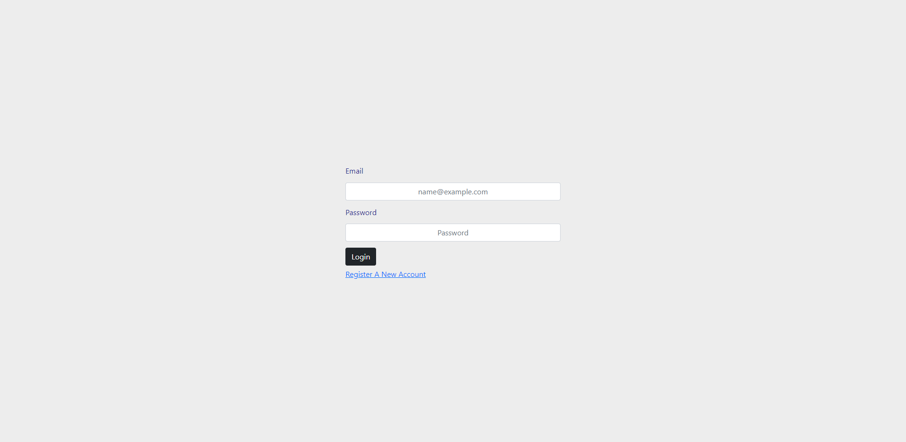

# PostGrad-Web-App
A web app that serves post-grads and their supervisors during their post-gradute studies

## Table of Contents
* [General Info](#general-information)
* [Technologies Used](#technologies-used)
* [Screenshots](#screenshots)
* [Project Status](#project-status)
* [Authors](#authors)

## General Information
- We Used ASP.NET as our framework and more specifically web forms
- used master pages to eliminate redundancy

## Technologies Used
- ASP.NET (Web Forms)
- BootStrap
- CSS
- SQL Server
- Visual Studio

## Screenshots

## Project Status
Project is: _complete_

## Authors
- [Mohamed Gallab](https://github.com/MohamedGallab)
- [Yousef Allam](https://github.com/YousefAllam221b)
- [Ahmed Wagdy](https://github.com/crosshuntter)
- [Mahmoud ElSherbiny](https://github.com/mahmoudelshirbeny)
